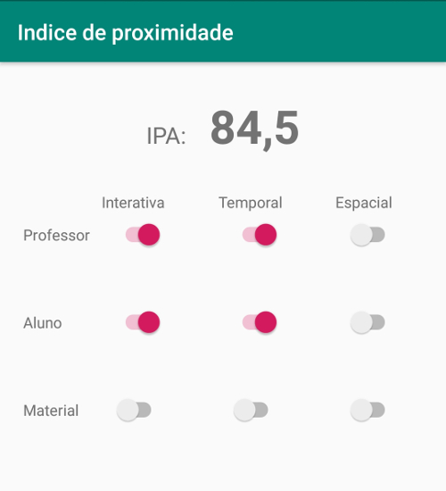

# Índice de Proximidade na Aprendizagem

Este aplicativo permite que você determine rapidamente o Índice de Proximidade na Aprendizagem (IPA), conforme definido por [Tori (2002)](http://www.lbd.dcc.ufmg.br/colecoes/rbie/10/2/001.pdf).

# Utilização

É bem simples: a única tela do aplicativo exibe 9 chaves, dispostas numa matriz 3 x 3 (figura abaixo). Cada linha representa uma relação (cf. artigo do Prof. Tori): aluno-**professor**, aluno-**aluno** e aluno-**material**; cada coluna representa um tipo de distância: interativa, temporal e espacial. Ao ligar a chave na linha "professor" e coluna "interativa", por exemplo, você está dizendo que há uma relação de proximidade interativa entre aluno e professor. Se essa chave estivesse desligada, ela significaria que **não** há essa proximidade.

A figura acima representa o exemplo 1 do referido artigo, que refere-se à seguinte situação: "atividade educacional interativa na Internet, baseada em _chat_, com a presença simultânea de todos os alunos e do professor, para discussão de um texto que todos leram previamente". Nesse caso, o índice de proximidade na aprendizagem é de 84,5:

# Instalação

A versão atual deste aplicativo (1.0.0) ainda não está disponível na Play Store, de modo que há três maneiras de você instalar o aplicativo no seu dispositivo:

1. Clone o repositório na sua máquina, abra-o com o Android Studio, gere o arquivo APK e instale-o. Ou...
2. Baixe o arquivo APK ([aqui](https://drive.google.com/file/d/1soHgQbdjbxWDaXq4IWGByrmCY5VVQBtm/view?usp=sharing)) e instale-o. Nesse último caso você terá de confiar em mim quando digo que não há nenhum código malicioso. Fica a seu critério. Ou...
3. Espere o aplicativo ser disponibilizado na Play Store. Porém, eu ainda não sei quando ocorrerá.

# Licença
[CC BY 4.0](https://creativecommons.org/licenses/by/4.0/)
